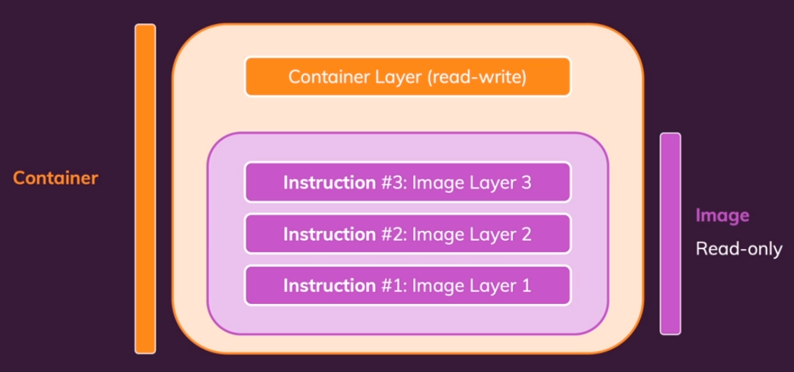
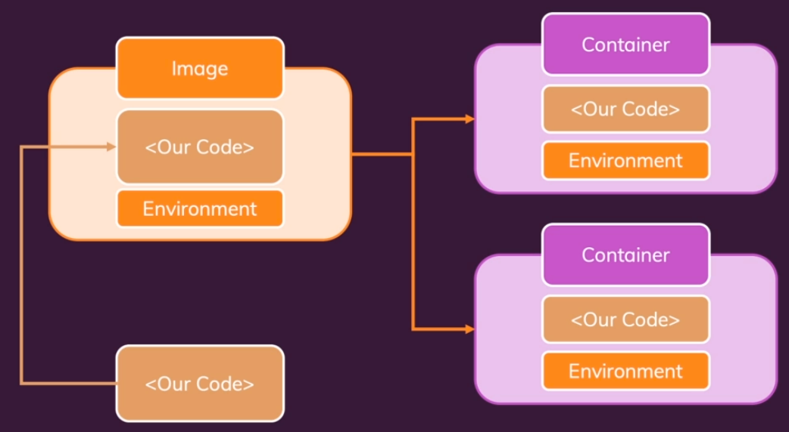
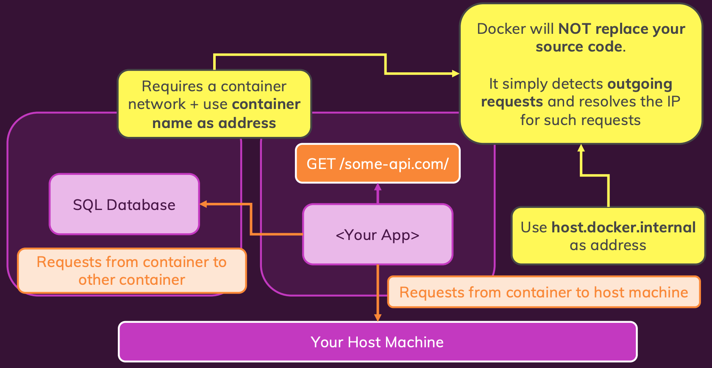
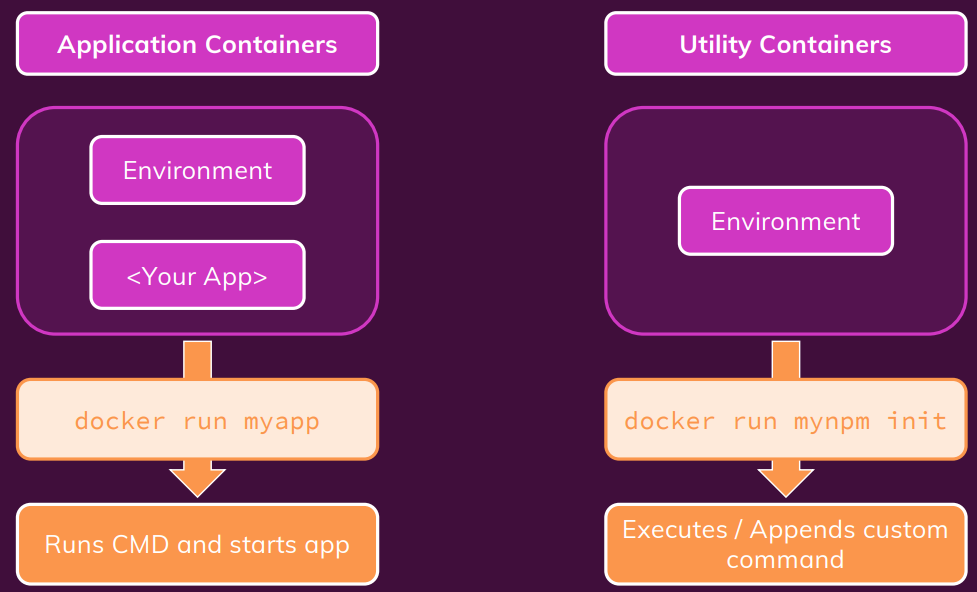
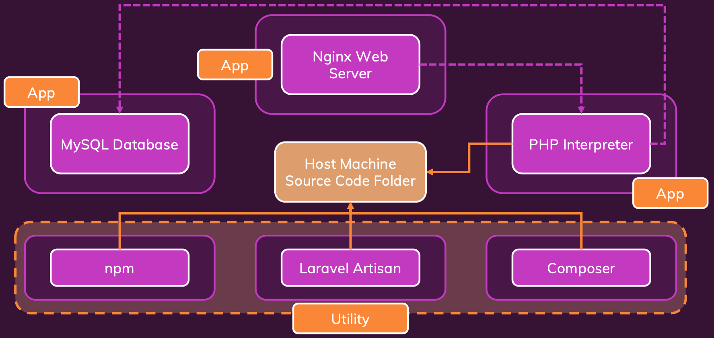
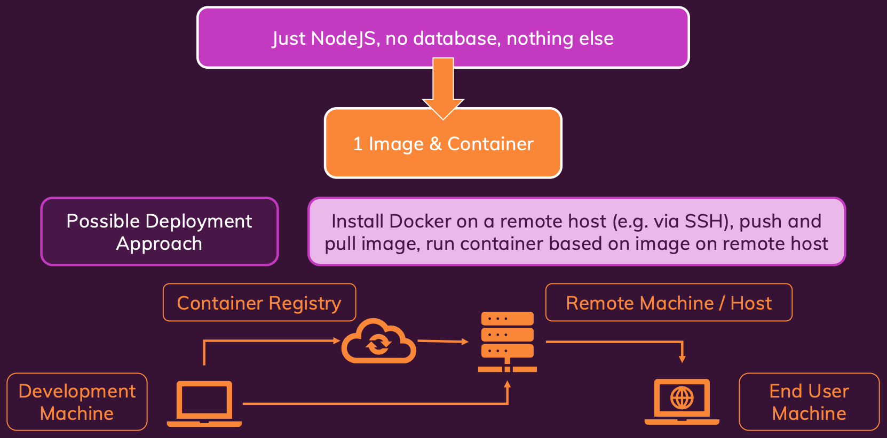

<details>
  <summary>Table of Contents</summary>
  <ol>
    <li><a href="#about-the-project">About The Project</a></li>
    <li><a href="#basics">Basics</a></li>
    <li><a href="#images--containers">Images & Containers</a></li>
    <li><a href="#data--volumes">Data & Volumes</a></li>
    <li><a href="#networking">Networking</a></li>
    <li><a href="#multi-containers-app">Multi-Containers App</a></li>
    <li><a href="#docker-compose">Docker Compose</a></li>
    <li><a href="#utility-containers">Utility Containers</a></li>
    <li><a href="#laravel--php">Laravel & PHP</a></li>
    <li><a href="#deployment">Deployment</a></li>
    <li><a href="#aws-ec2">AWS EC2</a></li>
    <li><a href="#aws-ecs">AWS ECS</a></li>
  </ol>
</details>

&nbsp;

## About The Project

- Docker & Kubernetes: The Practical Guide [2022 Edition]
- Learn Docker, Docker Compose, Multi-Container Projects, Deployment and all about Kubernetes from the ground up!
- [Maximilian Schwarzmüller](https://github.com/maxschwarzmueller)
- [Academind](https://academind.com/)

&nbsp;

## Basics

- [Docker](https://www.docker.com/) is a container technology: A tool for creating and managing containers.
  - <b>Environment: </b> The runtimes, languages & frameworks
  - Development environment and production environment are often not the same
- <b>Virtual Machines</b>

|                               Pro                                |                                     Con                                     |
| :--------------------------------------------------------------: | :-------------------------------------------------------------------------: |
|                      Separated environments                      |                    Redundant duplication, waste of space                    |
|         Environment-specific configurations are possible         |               Performance can be slow, boot times can be long               |
| Environment configurations can be shared and reproduced reliably | Reproducing on another computer/ server is possible but may still be tricky |

|                     Docker Containers                      |                        Virtual Machines                         |
| :--------------------------------------------------------: | :-------------------------------------------------------------: |
|   Low impact on OS, very fast, minimal disk space usage    |      Bigger impact on OS, slower, higher disk space usage       |
|       Sharing, re-building and distribution is easy        |    Sharing, re-building and distribution can be challenging     |
| Encapsulate apps/ environments instead of "whole machines" | Encapsulate "whole machines" instead of just apps/ environments |

- <b>Docker Tools & Building blocks</b>:
  - Docker Engine
  - Docker Desktop (incl. Daemon & CLI)
  - Docker Hub
  - Docker Compose

&nbsp;

---

&nbsp;

- Foundation

  - Images & Containers
  - Data & Volumes (in Containers)
  - Containers & Networking

- "Real Life"
  - Multi-Container Projects
  - Using Docker-Compose
  - "Utility Containers"
  - Deploying Docker Containers
- Kubernetes
  - Basics
  - Data & Volumes
  - Networking
  - Deploying a Kubernetes Clusters

&nbsp;

---

&nbsp;

## Images & Containers

|                  Images                  |                      Containers                       |
| :--------------------------------------: | :---------------------------------------------------: |
|   Templates/ Blueprints for containers   |            The running "unit of software"             |
| Contains code + required tools/ runtimes | Multiple containers can be created based on one image |

- Using Pre-Built & Custom Images
  - [Docker Hub](https://hub.docker.com/)
  - A container is base on an image
- Creating & Managing Containers



&nbsp;



|                         Images                         |                      Containers                      |
| :----------------------------------------------------: | :--------------------------------------------------: |
| Can be <b>tagged</b> (named) <i>-t, docker tag ...</i> |          Can be <b>named</b> <i>--name</i>           |
|       Can be <b>listed</b> <i>docker images</i>        | Can be <b>configured in detail</b> see <i>--help</i> |
|   Can be <b>analyzed</b> <i>docker image inspect</i>   |        Can be <b>listed</b> <i>docker ps</i>         |
| Can be <b>removed</b> <i>docker rmi, docker prune</i>  |        Can be <b>removed</b> <i>docker rm</i>        |

- Image tags (name : tag)
  - <b>name: </b>Defines a <b>group</b> of, <b>possible more specialized</b>, images (e.g. "node")
  - <b>tag: </b>Defines a <b>specialized image within a group of images</b> (e.g. "14")
- Specify the version (tag) to use
- Docker Hub
  - Official Docker Image Registry
  - Pubic, private and "official" mages
- Private Registry
  - Any provider/registry you want to use
  - Only your own (or team) images <b>(Needs to be HOST:NAME to talk to private registry)</b>
  - Share: `docker push IMAGE_NAME`
  - Use: `docker pull IMAGE_NAME`

&nbsp;

---

&nbsp;

> <b>ahmet: </b>Pulling and running image
> Let's say I have pulled an image from Dockerhub which is a webserver listening a port, how can I know that which port it's listening without seeing code? Maybe we'll cover that in future lessons..
>
> <b>Maximilian: </b>That's why you typically should document that via EXPOSE in your Dockerfile. If you pull some image where you never saw the Dockerfile, it should be documented on Docker Hub.

&nbsp;

---

&nbsp;

## Data & Volumes

|                  Application                  |                 Temporary App Data                  |                    Permanent App Data                     |
| :-------------------------------------------: | :-------------------------------------------------: | :-------------------------------------------------------: |
|       Application (Code + Environment)        |    Temporary App Data (e.g. entered user input)     |            Permanent App Data (user accounts)             |
|  Written & provided by you (= the developer)  |       Fetched / Produced in running container       |          Fetched / Produced in running container          |
|  Added to image and container in build phase  |         Stored in memory or temporary files         |               Stored in files or a database               |
| “Fixed”: Can’t be changed once image is built |     Dynamic and changing, but cleared regularly     |      Must not be lost if container stops / restarts       |
|       Read-only, hence stored in Images       | Read + write, temporary, hence stored in Containers | Read + write, permanent, stored with Containers & Volumes |

- Volumes are folders on your host machine hard drive which are mounted (“made available”, mapped) into containers
  - Anonymous
  - Named
- Host (Your Computer) /some-path <---> /app/user-data
- Volumes persist if a container shuts down. If a container (re-)starts and mounts a volume, any data inside of that volume is available in the container.
- A container can write data into a volume and read data from it.
- <b>Bind Mounts </b>are great for persistent and editable data
- For Windows using WSL Tool, there is a need to access Linux filesystems

|                      Command                      | Persist State |
| :-----------------------------------------------: | :-----------: |
|        `docker run -v /app/data ...</code>        | Anonymous V`  |
|     `docker run -v data:/app/data ...</code>      |  Named Vol`   |
| `docker run -v /path/to/code:/app/code ...</code> |   Bind Mou`   |

|                       Anonymous Volumes                        |                         Named Volumes                          |                           Bind Mounts                            |
| :------------------------------------------------------------: | :------------------------------------------------------------: | :--------------------------------------------------------------: |
|          Created specifically for a single container           |    Created in general – not tied to any specific container     | Location on host file system, not tied to any specific container |
|   Survives container shutdown / restart unless --rm is used    | Survives container shutdown / restart – removal via Docker CLI |    Survives container shutdown / restart – removal on host fs    |
|              Can not be shared across containers               |                Can be shared across containers                 |                 Can be shared across containers                  |
| Since it’s anonymous, it can’t be re-used (even on same image) |      Can be re-used for same container (across restarts)       |       Can be re-used for same container (across restarts)        |

- <b>Read-only Volume</b>
- We remove `COPY . .</code> in the dockerfile while using bind mount run command but we will not be using it when we are in the prod`

&nbsp;

---

&nbsp;

> <b>Lin: </b>Why do we not use bind mounts in production?

> <b>Adam: </b>You don't want to use bind mounts in production because they aren't very portable. If I gave you a command to start a container with an absolute path to the volume then you wouldn't be able to use it without editing it for your filesystem. Named volumes don't have that problem.

&nbsp;

---

&nbsp;

- Docker supports build-time <b>ARGuments</b> and runtime <b>ENVironment</b> variables

|                                      ARG                                      |                         ENV                          |
| :---------------------------------------------------------------------------: | :--------------------------------------------------: |
| Available inside of Dockerfile, NOT accessible in CMD or any application code | Available inside of Dockerfile & in application code |
|               Set on image build (docker build) via --build-arg               | Set via ENV in Dockerfile or via --env on docker run |

> <b>Environment variables and security: </b>Depending on which kind of data you're storing in your environment variables, you might not want to include the secure data directly in your Dockerfile.
>
> Instead, go for a separate environment variables file which is then only used at runtime (i.e. when you run your container with docker run). Otherwise, the values are "baked into the image" and everyone can read these values via `docker history IMAGE<`
>
> For some values, this might not matter but for credentials, private keys etc. you definitely want to avoid that! If you use a separate file, the values are not part of the image since you point at that file when you run docker run. But make sure you don't commit that separate file as part of your source control repository, if you're using source control.

&nbsp;

---

&nbsp;

## Networking

- Container to WWW communication
- Container to local host machine
- Container to container communication


&nbsp;



> Docker Networks actually support different kinds of <b>"Drivers"</b> which influence the behavior of the Network. The default driver is the <b>"bridge" driver</b> - it provides the behavior shown in this module (i.e. Containers can find each other by name if they are in the same Network).
>
> The driver can be set when a Network is created, simply by adding the `--driver</code> `
>
> `docker network create --driver bridge my-net`
>
> Of course, if you want to use the "bridge" driver, you can simply omit the entire option since "bridge" is the default anyways. Docker also supports these alternative drivers - though you will use the "bridge" driver in most cases:
>
> <b>host: </b>For standalone containers, isolation between container and host system is removed (i.e. they share localhost as a network)
>
> <b>overlay: </b>Multiple Docker daemons (i.e. Docker running on different machines) are able to connect with each other. Only works in "Swarm" mode which is a dated / almost > deprecated way of connecting multiple containers
>
> <b>macvlan: </b>You can set a custom MAC address to a container - this address can then be used for communication with that container
>
> <b>none: </b>All networking is disabled.
>
> <b>Third-party plugins: </b>You can install third-party plugins which then may add all kinds of behaviors and functionalities
>
> As mentioned, the "bridge" driver makes most sense in the vast majority of scenarios.

&nbsp;

---

&nbsp;

> <b>John: </b>Swarm, outdated or out branded?
>
> You cited Swarm as "dated / almost deprecated way of connecting multiple containers". Interesting as Bret Fisher, Docker Captain who does most of Docker's release cycle updates for the community has a very different take. He prefers Swarm but realizes Kubes has overwhelmed the community with marketing.
>
> Secondary, Swarm is less complicated though Kubes is trying to uncomplicate itself. Kubes also has higher system requirements. If you have massive complexity and scale extrodinaire then yes, Kubes is a winning choice. It has been said the first rule of architecture is "Everything in software architecture is a tradeoff". Kubes is no exception, and Swarm is also no exception. Swarm is the best choice in many situations.
>
> P.S. When I got my Docker Enterprise course certificate, official training, the instructor just two years ago said that eight out of ten deployments were on Swarm. Also, Mirantis was going to do away with Swarm and due to customer input have pulled Swarm back into long term support plans. Remember, K.I.S.S.? Why do Kubes if it's not needed?
>
> <b>Maximilian: </b>Yeah, swarm can be easier to get started with - still, I'm not convinced by Swarm's future.
>
> You will find different opinions out there for sure but whilst Kubernetes is clearly under very active development, the same can't really be said for Swarm. You can use it and it might "not go anywhere" but it also doesn't look like it's really being embraced by large chunks of the community.
>
> This [article](https://medium.com/@markuman/is-docker-swarm-mode-eol-7a3f316116a3) is also quite interesting.
>
> Feel free to use whatever you personally prefer - Docker Swarm might do the trick of course. But I definitely see Kubernetes being and becoming more important.

&nbsp;

---

&nbsp;

## Multi-Containers App

- [Docker Hub Mongo image - Authentication](https://hub.docker.com/_/mongo/)

### goals-app

> <b>Bernard: </b>Better solution for the goals app
> A better solution is to use the proxy feature of create-react-app (based on webpack dev server). Add the following line to your frontend package.json:
>
> `"proxy": "http://goals-backend:80"`
>
> Then, you can stop mapping the port 80 from the backend. Modify the react App.js to connect to `localhost:3000` instead of `localhost`.
>
> In this setup, only the frontend app (port 3000) is exposed and all backend calls are proxied inside the container network. This is solution is more secure and ressemble better a setup which could be used in production.

&nbsp;

---

&nbsp;

## Docker Compose

- What Docker Compose is NOT
  - does NOT replace Dockerfiles for custom Images
  - does NOT replace Images or Containers
  - is NOT suited for managing multiple containers on different hosts (machines)
- Services (Containers)
  - Published Ports
  - Environment Variables
  - Volumes
  - Networks
- [Compose file versions and upgrading](https://docs.docker.com/compose/compose-file/compose-versioning/)

&nbsp;

---

&nbsp;

## Utility Containers



> <b>Scott: </b>Utility Containers and Linux
> I wanted to point out that on a Linux system, the Utility Container idea doesn't quite work as you describe it. In Linux, by default Docker runs as the "Root" user, so when we do a lot of the things that you are advocating for with Utility Containers the files that get written to the Bind Mount have ownership and permissions of the Linux Root user. (On MacOS and Windows10, since Docker is being used from within a VM, the user mappings all happen automatically due to NFS mounts.)
>
> So, for example on Linux, if I do the following (as you described in the course):

```dockerfile
FROM node:14-slim
WORKDIR /app
```

```sh
$ docker build -t node-util:perm .
$ docker run -it --rm -v $(pwd):/app node-util:perm npm init

...

$ ls -la

total 16
drwxr-xr-x  3 scott scott 4096 Oct 31 16:16 ./
drwxr-xr-x 12 scott scott 4096 Oct 31 16:14 ../
drwxr-xr-x  7 scott scott 4096 Oct 31 16:14 .git/
-rw-r--r--  1 root  root   202 Oct 31 16:16 package.json
```

> You'll see that the ownership and permissions for the package.json file are "root". But, regardless of the file that is being written to the Bind Mounted volume from commands emanating from within the docker container, e.g. "npm install", all come out with "Root" ownership.
>
> <b>Solution 1: Use predefined "node" user (if you're lucky)</b>
> There is a lot of discussion out there in the docker community (devops) about security around running Docker as a non-privileged user (which might be a good topic for you to cover as a video lecture - or maybe you have; I haven't completed the course yet). The Official Node.js Docker Container provides such a user that they call "node".
>
> https://github.com/nodejs/docker-node/blob/master/Dockerfile-slim.template

```dockerfile
FROM debian:name-slim
RUN groupadd --gid 1000 node \
         && useradd --uid 1000 --gid node --shell /bin/bash --create-home node
```

> Luckily enough for me on my local Linux system, my "scott" uid:gid is also 1000:1000 so, this happens to map nicely to the "node" user defined within the Official Node Docker Image. So, in my case of using the Official Node Docker Container, all I need to do is make sure I specify that I want the container to run as a non-Root user that they make available. To do that, I just add:

```dockerfile
FROM node:14-slim
USER node
WORKDIR /app
```

> If I rebuild my Utility Container in the normal way and re-run "npm init", the ownership of the package.json file is written as if "scott" wrote the file.

```sh
$ ls -la

total 12
drwxr-xr-x  2 scott scott 4096 Oct 31 16:23 ./
drwxr-xr-x 13 scott scott 4096 Oct 31 16:23 ../
-rw-r--r--  1 scott scott 204 Oct 31 16:23 package.json
```

> <b>Solution 2: Remove the predefined "node" user and add yourself as the user</b>
> However, if the Linux user that you are running as is not lucky to be mapped to 1000:1000, then you can modify the Utility Container Dockerfile to remove the predefined "node" user and add yourself as the user that the container will run as:

```dockerfile
FROM node:14-slim

RUN userdel -r node

ARG USER_ID

ARG GROUP_ID

RUN addgroup --gid $GROUP_ID user

RUN adduser --disabled-password --gecos '' --uid $USER_ID --gid $GROUP_ID user

USER user

WORKDIR /app
```

> And then build the Docker image using the following (which also gives you a nice use of ARG):

```sh
$ docker build -t node-util:cliuser --build-arg USER_ID=$(id -u) --build-arg GROUP_ID=$(id -g) .

$ docker run -it --rm -v $(pwd):/app node-util:cliuser npm init
$ ls -la

total 12
drwxr-xr-x  2 scott scott 4096 Oct 31 16:54 ./
drwxr-xr-x 13 scott scott 4096 Oct 31 16:23 ../
-rw-r--r--  1 scott scott  202 Oct 31 16:54 package.json
```

> [Reference to Solution 2 above](https://vsupalov.com/docker-shared-permissions/)
>
> Keep in mind that this image will not be portable, but for the purpose of the Utility Containers like this, I don't think this is an issue at all for these "Utility Containers"

> <b>Jim: </b>I have encountered this on our AWS ECS deployments. We create an unprivileged user account as part of the Docker build process, just like you have documented here. Then the app runs under the user account and not as root.

> <b>raymi: </b>The php volumes in docker compose config in "Adding PHP Container" section should have been "cached" instead of "delegated" because most often changes come from the host side for dev and "read-only" is mostly on containers side. Please let me know.. what you reckon ? agree or disagree and reasons or I missed something ? just providing a feedback for improvement. love the course and keep it up Max

> <b>Maximilian: </b>Here's a good comparison of delegated vs cached: https://tkacz.pro/docker-volumes-cached-vs-delegated/
>
> I favor delegated here because we don't need container writes (primarily log files) to be reflected back onto our host machine immediately. That's not important here. We do definitely need to ensure that changes on the host machine are immediately reflected inside of the container though.

> <b>Volkoff: </b>Found nice TLDR tip on stackoverflow to make whole "delegated-cached" issue clear
>
> Use `cached`: when the host performs changes, the container is in read only mode.
>
> Use `delegated`: when docker container performs changes, host is in read only mode.
>
> Use `default`: When both container and host actively and continuously perform changes on data.

&nbsp;

---

&nbsp;

## Laravel & PHP



- [Docker Hub nginx image](https://hub.docker.com/_/nginx/)
- [Laravel installation](https://laravel.com/docs/9.x/installation)

- Instead of stating the `ports` under php service in `docker-compose.yaml` file:

```dockerfile
services:
  ...
  php:
    ...
    ports:
      - '3000:9000'
```

- We can change the port from 3000 to 9000 in the `nginx.conf` file like so `fastcgi_pass php:9000;`
- Because we have container to container communication via network instead of localhost

&nbsp;

---

&nbsp;

## Deployment

|                                                 Development                                                  |                                            Production                                             |
| :----------------------------------------------------------------------------------------------------------: | :-----------------------------------------------------------------------------------------------: |
|                                       Isolated, standalone environment                                       |                                 Isolated, standalone environment                                  |
|                               Reproducible environment, easy to share and use                                |                          Reproducible environment, easy to share and use                          |
|                                 Bind Mounts shouldn’t be used in Production!                                 |                   Containerized apps might need a build step (e.g. React apps)                    |
| Multi-Container projects might need to be split (or should be split) across multiple hosts / remote machines |                 Trade-offs between control and responsibility might be worth it!                  |
|              Containers should encapsulate the runtime environment but not necessarily the code              | A container should really work standalone, you should NOT have source code on your remote machine |
|             Use “Bind Mounts” to provide your local host project files to the running container              |                          Use COPY to copy a code snapshot into the image                          |
|                         Allows for instant updates without restarting the container                          |        Ensures that every image runs without any extra, surrounding configuration or code         |



- <b>Hosting Providers</b>
  - Amazon Web Services (AWS)
  - Microsoft Azure
  - Google Cloud

|                        <b>Option 1: </b>Deploy Source                        |          <b>Option 2: </b>Deploy Built Image          |
| :--------------------------------------------------------------------------: | :---------------------------------------------------: |
|                        Build image on remote machine                         | Build image before deployment (e.g. on local machine) |
| Push source code to remote machine, `run docker build` and then `docker run` |               Just execute `docker run`               |
|                            Unnecessary complexity                            |         Avoid unnecessary remote server work          |

&nbsp;

---

&nbsp;

## AWS EC2

- <b>Reference: </b>dep-basic-nodeapp
- A service that allows you to spin up and manage your own remote machines
  1. Create and launch EC2 instance, VPC and security group
  2. Configure security group to expose all required ports to WWW
  3. Connect to instance (SSH), install Docker and run container

1. Launch an instance for EC2
2. <b>Application and OS Images (Amazon Machine Image): </b>Amazon Linux AMI 64-bit (x86)
3. <b>Instance type: </b>t2.micro (Free tier eligible)
4. <b>Key pair: </b>Create a new key pair
   1. <b>Key pair name: </b>Enter key pair name
   2. <b>Key pair type: </b>RSA
   3. <b>Private key file format: </b>.pem
   4. Save the .pem file into the project root directory
   5. <b>Take note that anyone with the file will be able to connect to your remote machine</b>
5. <b>Network: </b>vpc
6. Launch instance
7. View all instances
8. <b>Select your instance, connect and follow the steps under SSH client</b>
9. `sudo yum update -y` to ensure all essential packages on the remote machine are updated
10. `sudo amazon-linux-extras install docker`
    - [Docker engine installation for other providers](https://docs.docker.com/engine/install/)
11. `sudo service docker start`
12. `docker tag CONTAINER darrela/CONTAINER` e.g. `docker tag dep-basic-nodeapp darrela/dep-basic-nodeapp`
13. Push image to Docker Hub
14. `sudo docker run --rm -dp 80:80 darrela/dep-basic-nodeapp`
    - Refer to Ryan's comment below for Apple M1
15. Under <b>Network & Security - Security Groups: </b>
    - Edit inbound rules
    - <b>Add rule: </b>HTTP & Anywhere-IPv4
    - Save rules
16. Go to Public IPv4 address
17. Use `sudo docker pull` to update the image after rebuilding and pushing to Docker Hub

- "DIY" Approach disadvantage
  - We fully “own” the remote machine è We’re responsible for it (and it’s security)!
    - Keep essentials software updated
    - Manage network and security groups/ firewall
  - SSHing into the machine to manage it can be annoying

&nbsp;

---

&nbsp;

> <b>Ryan: </b>The requested image's platform (linux/arm64/v8) does not match the detected host platform (linux/amd64) and no specific platform was requested
>
> If you built the Docker image on a MacBook with the M1 chip, and you try to run the Docker image on your EC2, you'll get the error above.
>
> To solve this, rebuild the image locally using this command:
>
> `docker buildx build --platform linux/amd64 -t node-dep-example .`
>
> You're essentially forcing the Docker image to be rebuilt using the specified architecture (linux/amd64) vs. using the detected architecture of your MacBook (linux/arm64/v8), which simply can't run on the selected EC2.
>
> Now tag the image with your Docker hub repository name as before:
>
> `docker tag node-dep-example <your-account>/node-example-1`
>
> And push the new image to Docker hub as before:
>
> `docker push <your-account>/node-example-1`
>
> Switch back to the EC2 and delete the local version of the Docker image it previously downloaded:
>
> `sudo docker rmi <your-account>/node-example-1`
>
> Last, run the newly built Docker image on the EC2, which should now work:
>
> `sudo docker run -d --rm -p 80:80 <your-account>/node-example-1`

&nbsp;

---

&nbsp;

## AWS ECS

|                                          EC2                                           |                                              ECS                                              |
| :------------------------------------------------------------------------------------: | :-------------------------------------------------------------------------------------------: |
| You need to create them, manage them, keep them updated, monitor them, scale them etc. | Creation, management, updating is handled automatically, monitoring and scaling is simplified |
|                  Great if you’re an experienced admin / cloud expert                   |                   Great if you simply want to deploy your app / containers                    |

- <b>Reference: </b>dep-basic-nodeapp

1. Get Started
2. <b>custom</b> Configure
3. <b>Container name: </b>dep-basic-nodeapp
4. <b>Image: </b>darrela/dep-basic-nodeapp
5. <b>Port mappings: </b>Refer to server.js/app.js port e.g. 80
6. <b>Log configuration: </b>Check Auto-configure CloudWatch Logs
7. Next (Optional: Application Load Balancer)
8. Next > Create > View Service
9. Task > Task ID > Public IP
10. <b>To update: </b>Push the new image to Docker Hub
11. Create new revision of Task Definition or directly under Actions click Update Service > Force new Deployment

- <b>Reference: </b>dep-multi-containers
- Docker compose is good for local machine. For deployment, host providers may need different requirements.

&nbsp;

---

&nbsp;
